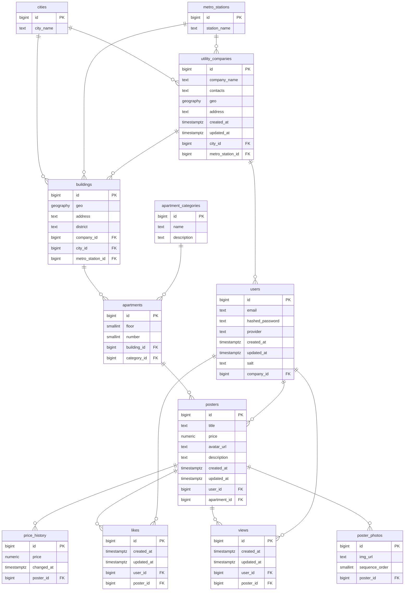

# Описание схемы базы данных

## Сущности

### `cities`
Хранит список городов.
- `id` — уникальный идентификатор
- `city_name` — название города (уникальное, до 40 символов)

### `metro_stations`
Хранит список станций метро.
- `id` — уникальный идентификатор
- `station_name` — название станции (уникальное, до 40 символов)

### `utility_companies`
Хранит информацию об управляющих компаниях (ЖК).
- `id` — уникальный идентификатор
- `company_name` — название компании
- `contacts` — контактная информация
- `geo` — географические координаты (тип PostGIS GEOGRAPHY POINT)
- `address` — адрес
- `created_at` — дата создания записи
- `updated_at` — дата последнего обновления записи
- `city_id` — идентификатор города (FK → `cities`)
- `metro_station_id` — идентификатор ближайшей станции метро (FK → `metro_stations`)

### `users`
Хранит информацию о пользователях платформы.
- `id` — уникальный идентификатор
- `email` — адрес электронной почты
- `hashed_password` — хеш пароля (может быть NULL при входе через OAuth)
- `provider` — провайдер OAuth (может быть NULL при входе по паролю)
- `created_at` — дата регистрации
- `updated_at` — дата последнего обновления
- `salt` — соль для хеширования пароля
- `company_id` — идентификатор управляющей компании (FK → `utility_companies`)

### `buildings`
Хранит информацию о домах/зданиях.
- `id` — уникальный идентификатор
- `geo` — географические координаты здания (тип PostGIS GEOGRAPHY POINT)
- `address` — адрес здания
- `district` — район
- `company_id` — управляющая компания (FK → `utility_companies`)
- `city_id` — город (FK → `cities`)
- `metro_station_id` — ближайшая станция метро (FK → `metro_stations`)

### `apartment_categories`
Хранит типы/категории помещений.
- `id` — уникальный идентификатор
- `name` — название категории (например, «квартира», «коммерческое», «паркинг»)
- `description` — описание категории

### `apartments`
Хранит информацию о помещениях (квартирах).
- `id` — уникальный идентификатор
- `floor` — этаж
- `number` — номер помещения
- `building_id` — здание, в котором находится помещение (FK → `buildings`)
- `category_id` — категория помещения (FK → `apartment_categories`)

### `posters`
Хранит объявления о продаже/аренде помещений.
- `id` — уникальный идентификатор
- `title` — заголовок объявления
- `price` — цена
- `avatar_url` — ссылка на главное изображение объявления
- `description` — описание
- `created_at` — дата создания объявления
- `updated_at` — дата последнего обновления
- `user_id` — пользователь, разместивший объявление (FK → `users`)
- `apartment_id` — помещение, о котором объявление (FK → `apartments`)

### `price_history`
Хранит историю изменения цены по объявлению.
- `id` — уникальный идентификатор
- `price` — цена на момент изменения
- `changed_at` — дата и время изменения цены
- `poster_id` — идентификатор объявления (FK → `posters`)

### `likes`
Хранит лайки пользователей на объявления.
- `id` — уникальный идентификатор
- `created_at` — дата создания лайка
- `updated_at` — дата последнего обновления
- `user_id` — пользователь, поставивший лайк (FK → `users`)
- `poster_id` — объявление, которому поставлен лайк (FK → `posters`)

### `views`
Хранит просмотры объявлений пользователями.
- `id` — уникальный идентификатор
- `created_at` — дата первого просмотра
- `updated_at` — дата последнего просмотра
- `user_id` — пользователь, просмотревший объявление (FK → `users`)
- `poster_id` — просмотренное объявление (FK → `posters`)

### `poster_photos`
Хранит фотографии, прикреплённые к объявлению.
- `id` — уникальный идентификатор
- `img_url` — ссылка на изображение
- `sequence_order` — порядковый номер фото в галерее
- `poster_id` — идентификатор объявления (FK → `posters`)

---

## Сущности и их функциональные зависимости

### cities
`{id} → {city_name}`  
**1NF**: ✓ **2NF**: ✓ **3NF**: ✓ **BCNF**: ✓

### metro_stations
`{id} → {station_name}`  
**1NF**: ✓ **2NF**: ✓ **3NF**: ✓ **BCNF**: ✓

### utility_companies
`{id} → {company_name, contacts, geo, address, created_at, updated_at, city_id, metro_station_id}`  
**1NF**: ✓ **2NF**: ✓ **3NF**: ✓ **BCNF**: ✓

### users
`{id} → {email, hashed_password, provider, created_at, updated_at, salt, company_id}`  
**1NF**: ✓ **2NF**: ✓ **3NF**: ✓ **BCNF**: ✓

### buildings
`{id} → {geo, address, district, company_id, city_id, metro_station_id}`  
**1NF**: ✓ **2NF**: ✓ **3NF**: ✓ **BCNF**: ✓

### apartment_categories
`{id} → {name, description}`  
**1NF**: ✓ **2NF**: ✓ **3NF**: ✓ **BCNF**: ✓

### apartments
`{id} → {floor, number, building_id, category_id}`  
**1NF**: ✓ **2NF**: ✓ **3NF**: ✓ **BCNF**: ✓

### posters
`{id} → {title, price, avatar_url, description, created_at, updated_at, user_id, apartment_id}`  
**1NF**: ✓ **2NF**: ✓ **3NF**: ✓ **BCNF**: ✓

### price_history
`{id} → {price, changed_at, poster_id}`  
**1NF**: ✓ **2NF**: ✓ **3NF**: ✓ **BCNF**: ✓

### likes
`{id} → {created_at, updated_at, user_id, poster_id}`  
**1NF**: ✓ **2NF**: ✓ **3NF**: ✓ **BCNF**: ✓

### views
`{id} → {created_at, updated_at, user_id, poster_id}`  
**1NF**: ✓ **2NF**: ✓ **3NF**: ✓ **BCNF**: ✓

### poster_photos
`{id} → {img_url, sequence_order, poster_id}`  
**1NF**: ✓ **2NF**: ✓ **3NF**: ✓ **BCNF**: ✓

---

## Общее заключение

Все отношения в схеме соответствуют требованиям:
- **1NF**: Все атрибуты атомарны, нет повторяющихся групп
- **2NF**: Нет частичных зависимостей (все PK состоят из одного атрибута)
- **3NF**: Нет транзитивных зависимостей
- **BCNF**: Все детерминанты являются потенциальными ключами

Схема полностью нормализована и не содержит аномалий вставки, обновления и удаления.

---

## ER-диаграмма базы данных

